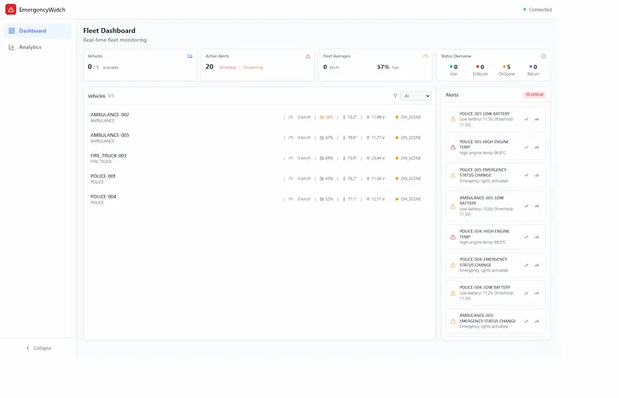
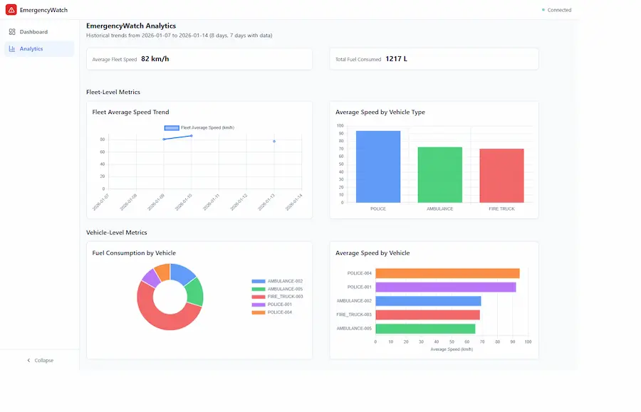

# EmergencyWatch

A production-ready **microservices-based emergency vehicle fleet observability platform** demonstrating event-driven architecture, distributed systems patterns, and cloud-native deployment practices.

**Built with:** Java 21 • Spring Boot 3 • React 19 • Apache Kafka • PostgreSQL

**Deployed on:** Azure Container Apps • Azure API Management

## Overview

EmergencyWatch monitors emergency vehicle fleets in real-time, ingesting and processing telemetry data (fuel levels, engine temperature, battery voltage, emergency status) through a modern, scalable microservices architecture. The system detects critical operational conditions and provides live visibility through an interactive web dashboard.

This project demonstrates enterprise-grade patterns including event-driven communication, 
secure data persistence, distributed tracing, comprehensive testing, and cloud-native 
deployment-designed to showcase architectural decision-making and production-readiness beyond typical bootcamp projects.

> **[Live Demo - https://emergencywatch.denizaltun.de](https://emergencywatch.denizaltun.de/)**

### Key Highlights

✅ **Microservices Architecture** - Event-driven services communicating through Kafka  
✅ **Polyglot Persistence** - PostgreSQL for transactional data, MongoDB for analytics   
✅ **Real-time Data Processing** - Sub-second alert detection on telemetry streams  
✅ **Cloud-native Design** - Azure Container Apps, Container Registry, API Management  
✅ **Comprehensive Testing** - 76+ unit tests with >80% code coverage  
✅ **Production Observability** - SonarQube integration, OpenAPI documentation, structured logging  
✅ **Domain-driven Design** - Leverages 2.5 years of embedded systems experience with vehicle telemetry  
✅ **CI/CD integration** with self-hosted Jenkins environment
---

## Screenshots

### Dashboard


### Analytics Page


---

## Tech Stack

### Backend Services
| Category | Choice | Rationale |
|----------|--------|-----------|
| **Language** | Java 21 | Modern LTS release with pattern matching and virtual threads |
| **Framework** | Spring Boot 3.5.7 | Industry-standard with comprehensive ecosystem (Cloud, Data, Web) |
| **Event Streaming** | Apache Kafka (KRaft mode) | Decoupled communication, event replay capability, horizontal scaling |
| **Relational DB** | PostgreSQL 17 | ACID compliance for operational alerts and telemetry |
| **Document DB** | MongoDB 7.0 | Schema flexibility for evolving analytics requirements |
| **Build Tool** | Maven 3.8+ | Standardized dependency management and plugin ecosystem |
| **Testing** | JUnit 5 + Mockito | Component and unit testing with industry-standard tools |
| **API Docs** | Springdoc-OpenAPI 2.x | Automated OpenAPI 3.0 spec generation with Swagger UI |

### Frontend
| Category | Choice | Rationale |
|----------|--------|-----------|
| **Language** | TypeScript 5.9 | Type safety, improved IDE support, maintainability at scale |
| **Framework** | React 19 | Component-based architecture, strong ecosystem |
| **Build Tool** | Vite 7 | Lightning-fast dev server and optimized production builds |
| **Styling** | Tailwind CSS 3.4 | Utility-first CSS, consistent design system, rapid iteration |
| **Data Fetching** | React Query (TanStack) | Server state management, caching, automatic retries, background sync |
| **HTTP Client** | Axios | Interceptor support, request/response transformation |
| **Visualization** | Chart.js 4 + react-chartjs-2 | Lightweight charting library, responsive visualizations |
| **Components** | Radix UI | Accessible, unstyled primitive components |

### Infrastructure & DevOps
| Category | Choice | Rationale |
|----------|--------|-----------|
| **Containerization** | Docker + Compose | Reproducible local development and consistent staging environment |
| **CI/CD** | Jenkins | Automated testing, code quality gates, and deployment pipelines |
| **Code Quality** | SonarQube Cloud | Automated code analysis, security scanning, quality gates |
| **Container Registry** | Azure Container Registry | Private image storage, integrated with Azure deployments |

### Cloud Deployment (Azure)
| Category | Service | Purpose |
|----------|---------|---------|
| **Compute** | Container Apps | Serverless containers with automatic scaling, managed Kubernetes abstraction |
| **API Gateway** | API Management | Rate limiting, API versioning, developer portal, centralized monitoring |
| **Frontend Hosting** | Static Web Apps | CDN-backed hosting with automatic GitHub integration |
| **Databases** | Azure Database for PostgreSQL (Flexible Server) | Managed relational DB with automatic backups, high availability for all operational and analytics data |
| **Event Broker** | Azure Event Hubs (Kafka API) | Managed Kafka-compatible event streaming with built-in compliance |

---

## Architecture

### System Design
```
Vehicle Telemetry Stream → Kafka Topic (vehicle-telemetry)
                        ↓
                [Data Processor]  ← Validates, Detects Alerts
                        ↓
                 PostgreSQL DB ← Persists all operational data
                        ↓
            Kafka Topic (alerts)
                        ↓
        [Notification Service] ← Alert deduplication & lifecycle
                        ↓
        PostgreSQL (alerts table)
                        ↓
            REST API → [React Frontend]

[Analytics Service] ← Consumes telemetry for real-time metrics
                    ← Scheduled aggregation job (PostgreSQL aggregations)
                        ↓
            REST API → [Frontend Charts]
```

### Microservices Breakdown

#### 1. **Vehicle Simulator** (Telemetry Generator)
Produces realistic vehicle telemetry data to simulate a live fleet.

**Responsibilities:**
- Generate telemetry for 5 emergency vehicles (fire trucks, ambulances, police)
- Vary sensor readings realistically (temperature, fuel consumption, speed)
- Publish to `vehicle-telemetry` Kafka topic every 15 seconds per vehicle

**Design Rationale:**
- Simpler movement simulation (no complex route modeling) prioritizes development velocity
- Demonstrates understanding of trade-offs between realism and implementation complexity

---

#### 2. **Data Processor** (Stream Processing & Alert Detection)
Consumes telemetry, validates data, detects alert conditions, and persists operational data.

**Key Responsibilities:**
- Deserialize and validate incoming telemetry messages
- Apply alert detection rules against configurable thresholds
- Deduplicate repeated alerts at ingestion boundary
- Persist telemetry and alerts to PostgreSQL
- Publish alert events to dedicated Kafka topic

**Alert Detection Rules:**

| Condition | Threshold | Service Impact |
|-----------|-----------|-----------------|
| **Low Fuel** | < 20% tank capacity | Operational efficiency alert |
| **High Engine Temp** | > 95°C | Engine health warning |
| **Low Battery** | < 11V (12V systems) / < 22V (24V) | Electrical system failure risk |
| **Emergency Status** | Activation detected | Real-time operational status |

**Technology Choices:**
- **Why Kafka consumption?** - Decouples simulator from processor, enables event replay for debugging
- **Why deduplicate here?** - Prevents cascading duplicate alerts through the system
- **Why separate alert topic?** - Isolates critical alerts from high-volume telemetry stream

**API:** http://localhost:8080 (Swagger: http://localhost:8080/swagger-ui.html)

---

#### 3. **Notification Service** (Alert Management & Lifecycle)
Manages alert state transitions, deduplication, and filtering. Provides query API for frontend.

**Features:**
- **Deduplication** - Prevents multiple active alerts for the same condition on the same vehicle
- **State Transitions** - ACTIVE → ACKNOWLEDGED → RESOLVED with timestamps
- **Flexible Filtering** - Query alerts by status, vehicle type, severity
- **Idempotent Operations** - State transitions are safe to retry without side effects

**Data Model:**
```
Alert {
  id: UUID,
  vehicleId: String,
  vehicleType: Enum(FIRE_TRUCK, AMBULANCE, POLICE),
  alertType: Enum(LOW_FUEL, HIGH_ENGINE_TEMP, LOW_BATTERY, EMERGENCY_STATUS),
  status: Enum(ACTIVE, ACKNOWLEDGED, RESOLVED),
  createdAt: Timestamp,
  acknowledgedAt: Timestamp (nullable),
  resolvedAt: Timestamp (nullable)
}
```

**Endpoints:**
- `GET /api/alerts/active` - Real-time active alerts for dashboard
- `GET /api/alerts` - Query with filtering by status, type, vehicle
- `PATCH /api/alerts/{id}/acknowledge` - Operator acknowledges alert
- `PATCH /api/alerts/{id}/resolve` - Alert condition cleared

**API:** http://localhost:8083 (Swagger: http://localhost:8083/swagger-ui.html)

---

#### 4. **Analytics Service** (Real-time & Historical Metrics)
Provides fleet-wide and per-vehicle analytics with scheduled aggregation for time-series analysis.

***Real-time Metrics:***
- Fleet-wide averages (speed, fuel level, battery voltage)
- Vehicle count by type and status
- Alert frequency and distribution
- Per-vehicle current metrics

***Historical Analytics:***
- Daily aggregation job (runs at midnight UTC)
- Per-vehicle fuel consumption trends
- Speed distribution by vehicle type

**Endpoints:**
- `GET /api/analytics/fleet` - Fleet-wide real-time metrics
- `GET /api/analytics/vehicles` - Per-vehicle current status and metrics
- `GET /api/analytics/history` - Historical aggregated data from MongoDB
- `GET /api/analytics/stats` - Key statistics and trends

**API:** http://localhost:8082 (Swagger: http://localhost:8082/swagger-ui.html)

---

### Frontend Dashboard

**Features:**
- Real-time fleet dashboard with vehicle status overview
- Interactive alerts panel with acknowledge/resolve actions
- Fleet analytics with charts (fuel consumption, speed trends)
- Historical metrics visualization
- Responsive design with Tailwind CSS

**Pages & Features:**

1. **Dashboard** (`/`)
    - Live fleet status with vehicle cards (status, fuel, temperature, battery)
    - Real-time active alerts panel with acknowledge/resolve actions
    - Fleet aggregates (average speed, total fuel, vehicle counts)
    - Auto-refresh every 15 seconds with React Query background sync

2. **Analytics** (`/analytics`)
    - Fuel consumption trend chart by vehicle type
    - Speed distribution chart

**Key UI Components:**
- `VehicleStatusCard` - Individual vehicle telemetry display
- `AlertsPanel` - Real-time alert management with state transitions
- `FleetMetrics` - Fleet-wide aggregate statistics
- `TrendChart` - Time-series visualization using Chart.js

---

## Getting Started

### Prerequisites
- **Java 21** (JDK, e.g., Temurin, Corretto)
- **Maven 3.8+**
- **Node.js 18+** with npm
- **Docker & Docker Compose** (for local infrastructure)

### Option 1: Local Development with Docker Compose
```bash
# 1. Start infrastructure (Kafka, PostgreSQL, MongoDB)
docker-compose up -d

# 2. Verify services are healthy
docker-compose ps

# 3. Run services in separate terminals
# Terminal 1: Vehicle Simulator (generates telemetry)
cd services/vehicle-simulator
mvn spring-boot:run

# Terminal 2: Data Processor (consumes telemetry, detects alerts)
cd services/data-processor
mvn spring-boot:run

# Terminal 3: Analytics Service (real-time & historical metrics)
cd services/analytics-service
mvn spring-boot:run

# Terminal 4: Notification Service (alert management)
cd services/notification-service
mvn spring-boot:run

# Terminal 5: React Frontend
cd frontend
npm install
npm run dev
```

### Option 2: IDE-based Development

If using IntelliJ IDEA:
1. Open the project as Maven multi-module project
2. Services → Run → Edit Configurations → Create separate run configs for each service
3. Use Docker Compose to start infrastructure: `docker-compose up -d`
4. Run each service independently with debugger support

### Verify the System
```bash
# Test Analytics Service
curl http://localhost:8082/api/analytics/fleet | jq

# Test Notifications Service
curl http://localhost:8083/api/alerts/active | jq

# Test Swagger documentation
open http://localhost:8082/swagger-ui.html
open http://localhost:8083/swagger-ui.html
```

### Access Points

| Component | URL | Purpose |
|-----------|-----|---------|
| **Frontend Dashboard** | http://localhost:5173 | Real-time fleet monitoring |
| **Analytics API** | http://localhost:8082 | Fleet metrics & historical data |
| **Notifications API** | http://localhost:8083 | Alert management |
| **Analytics Swagger** | http://localhost:8082/swagger-ui.html | Interactive API documentation |
| **Notifications Swagger** | http://localhost:8083/swagger-ui.html | Interactive API documentation |

---

## API Documentation

### OpenAPI Specification

Full OpenAPI 3.0 specifications are auto-generated and available in the `/docs` directory:
```
docs/api-documentation/swagger/
├── openapi-analytics.yaml
└── openapi-notification.yaml
```

### Live Documentation

**During Development (Localhost):**
- Analytics Service: http://localhost:8082/swagger-ui.html
- Notification Service: http://localhost:8083/swagger-ui.html

**Online Documentation:**
[View on GitHub Pages](https://ad-altun.github.io/EmergencyWatch/api-documentation/swagger/)


### Quick API Reference

#### Analytics Service

| Method | Endpoint | Description | Response |
|--------|----------|-------------|----------|
| GET | `/api/analytics/fleet` | Fleet-wide aggregates | `FleetMetricsDTO` |
| GET | `/api/analytics/vehicles` | All vehicles + metrics | `List<VehicleAnalyticsDTO>` |
| GET | `/api/analytics/history?days=7` | Historical metrics | `List<DailyAggregateDTO>` |
| GET | `/api/analytics/stats` | Key statistics | `FleetStatsDTO` |

**Example Response:**
```json
{
  "totalVehicles": 10,
  "averageFuelLevel": 65.3,
  "averageEngineTemp": 72.5,
  "activeAlerts": 3,
  "vehiclesByType": {
    "FIRE_TRUCK": 5,
    "AMBULANCE": 3,
    "POLICE": 2
  }
}
```

#### Notification Service

| Method | Endpoint | Description | Request/Response |
|--------|----------|-------------|------------------|
| GET | `/api/alerts/active` | Get active alerts | `List<AlertDTO>` |
| GET | `/api/alerts?status=ACTIVE` | Filter alerts | `List<AlertDTO>` |
| PATCH | `/api/alerts/{id}/acknowledge` | Mark as acknowledged | `AlertDTO` |
| PATCH | `/api/alerts/{id}/resolve` | Mark as resolved | `AlertDTO` |

**Example Alert Object:**
```json
{
  "id": "a1b2c3d4",
  "vehicleId": "TRUCK-001",
  "vehicleType": "FIRE_TRUCK",
  "alertType": "LOW_FUEL",
  "status": "ACTIVE",
  "message": "Fire truck TRUCK-001 fuel level below 20%",
  "createdAt": "2025-01-14T10:30:00Z",
  "acknowledgedAt": null,
  "resolvedAt": null
}
```

---

## Testing

The project includes comprehensive unit tests focusing on critical business logic.

### Running Tests
```bash
# Run tests with coverage
cd services/data-processor
mvn clean test jacoco:report

# View coverage report
open target/site/jacoco/index.html

# Run all tests
cd services/data-processor && mvn test
cd services/notification-service && mvn test
cd services/analytics-service && mvn test
```
### Test Coverage

| Service | Key Test Classes |
|---------|------------------|
| **data-processor** | `TelemetryProcessingServiceTest`, `AlertDetectionTest` |
| **notification-service** | `AlertServiceTest`, `AlertDeduplicationTest` |
| **analytics-service** | `AnalyticsServiceTest`, `MetricsAggregationServiceTest` |

---


## Configuration

### Service Port Mapping

| Component | Port | Notes |
|-----------|------|-------|
| Frontend | 5173 | Vite dev server |
| Data Processor | 8080 | Spring Boot default |
| Analytics Service | 8082 | Custom to avoid conflict |
| Notification Service | 8083 | Custom to avoid conflict |
| PostgreSQL | 55432 | Custom to avoid host conflicts |
| Kafka | 9092 | Standard Kafka port |
| MongoDB | 27017 | Standard MongoDB port |

### Environment Variables

#### Data Processor
```bash
SPRING_KAFKA_BOOTSTRAP_SERVERS=kafka:9092
SPRING_DATASOURCE_URL=jdbc:postgresql://postgres:55432/emergencywatch
SPRING_DATASOURCE_USERNAME=postgres
SPRING_DATASOURCE_PASSWORD=postgres
MANAGEMENT_ENDPOINTS_WEB_EXPOSURE_INCLUDE=health,prometheus,openapi,swagger-ui
```

#### Analytics Service
```bash
SPRING_KAFKA_BOOTSTRAP_SERVERS=kafka:9092
SPRING_DATASOURCE_URL=jdbc:postgresql://postgres:55432/emergencywatch
SPRING_DATASOURCE_USERNAME=postgres
SPRING_DATASOURCE_PASSWORD=postgres
SPRING_DATA_MONGODB_URI=mongodb://mongo:27017/emergencywatch
```

---

## Deployment

### Local Development
See "Getting Started" section above.

### Azure Container Apps

EmergencyWatch is designed for cloud-native deployment on Azure using:

**Services:**
- **Container Apps** - Serverless containers with auto-scaling, managed Kubernetes
- **Container Registry** - Private Docker image storage
- **API Management** - Rate limiting, API versioning, centralized monitoring
- **PostgreSQL Flexible Server** - Managed relational database
- **Event Hubs (Kafka API)** - Managed Kafka-compatible event streaming

**Current Status:** Services are deployed and functional. Azure deployment strategy leveraging Azure free credits for cost-effective cloud-native learning and demonstration.

---

## Project Statistics


[](https://sonarcloud.io/summary/new_code?id=ad-altun_EmergencyWatch)

---

## Troubleshooting

### Service won't start - Connection refused to Kafka
**Solution:** Ensure `docker-compose up -d` completed successfully and Kafka is healthy:
```bash
docker-compose ps
docker-compose logs kafka
```

### Frontend can't reach backend APIs
**Solution:** Check that backend services are running on expected ports:
```bash
curl http://localhost:8082/actuator/health
curl http://localhost:8083/actuator/health
```

### Tests failing with database connection errors
**Solution:** PostgreSQL may not be ready. Add explicit wait:
```bash
docker-compose up -d postgres
sleep 10  # Wait for PostgreSQL to be ready
mvn test
```

### High CPU usage during tests
**Solution:** Reduce test parallelism:
```bash
mvn -DthreadCount=1 test
```

---

## Contributing

This is a portfolio project, but feedback and suggestions are welcome. For major changes:

1. Fork the repository
2. Create a feature branch
3. Make your changes with tests
4. Submit a pull request with description

---

## License

MIT License - See [LICENSE](LICENSE) file for details.

This means you're free to use, modify, and distribute this code with proper attribution.

---

## Contact & Social

I'm actively searching for remote Java backend development positions. Let's connect:

<a href="https://github.com/ad-altun"></a>&nbsp;&nbsp;
<a href="https://www.linkedin.com/in/abidin-deniz-altun-46906a71/"></a>&nbsp;&nbsp;&nbsp;
<a href="https://denizaltun.de"></a>&nbsp;&nbsp;
<a href="mailto:contact@denizaltun.de"></a>

---

⭐ **If you find this project helpful, consider starring it!**

Questions about the architecture or implementation? Feel free to open an issue or reach out.

---
